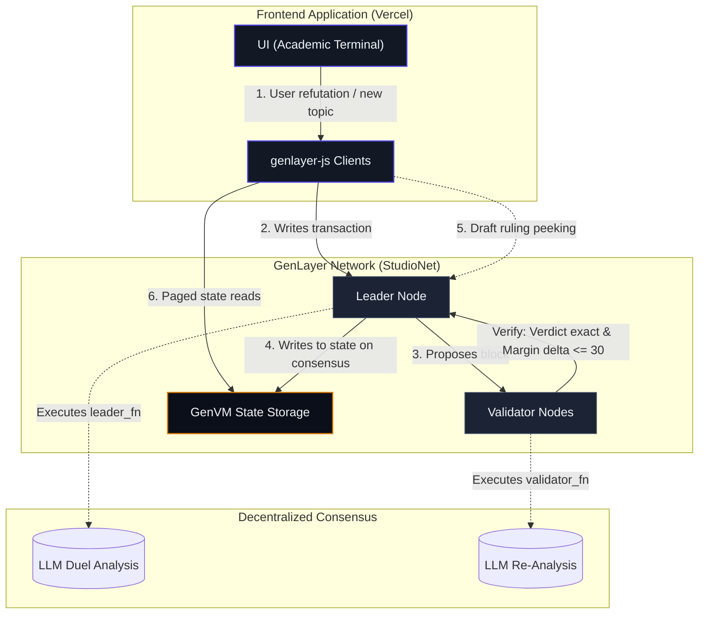

# Klash

**A Decentralized AI Dialectic Coliseum on GenLayer.**

Klash is an on-chain debate arena built on GenLayer where ideas clash for logical dominance. Each arena is founded on a specific topic and features a single reigning claim (the **Thesis**) held by its proponent. Challengers formulate a logical refutation (the **Antithesis**), and an AI consensus arbiter judges the two head-to-head. The Thesis only falls and changes hands when the opposing Antithesis is ruled decisively stronger by validator consensus; otherwise, the incumbent Thesis holds. Every succession of ideas is recorded permanently in the topic's **Dialectical Progression Timeline** on-chain.

- Live dApp: https://klash-pied.vercel.app/
- Deployed Contract (StudioNet): [`0x35dE19f52D209A4D841BA15bbEBefABb5B058C96`](https://explorer-studio.genlayer.com/address/0x35dE19f52D209A4D841BA15bbEBefABb5B058C96)

---

## Why GenLayer

Determining which of two competing arguments is logically superior is a subjective, language-level judgment. Traditionally, subjective arbitration on-chain has relied on expensive, slow crowdsourced oracle tribunals or centralized APIs prone to manipulation and prompt injections. 

Klash places subjective natural language evaluation under **decentralized validator consensus** in real-time. 

### Consensus Architecture & Stability
Subjective evaluation carries a major consensus risk: a naive "who wins?" query makes validators disagree on borderline decisions (near-ties), preventing transactions from settling. Klash mitigates this using two key layers:

1. **Incumbent Advantage Prompting:** The AI arbiter prompt enforces a strict rule: the reigning Thesis stands by default (`DEFEND`) unless the opposing Antithesis is *clearly* and decisively better reasoned. This forces borderline decisions away from the decision boundary and stabilizes consensus.
2. **Equivalence Principle with Tolerance:** The validator code executes a custom equivalence check via `gl.vm.run_nondet_unsafe`. It demands exact binary consensus on the verdict (`DEFEND` or `OVERTHROW`), but permits a tolerance threshold of up to **30 points** on the subjective margin score, preventing consensus splits due to minor non-deterministic numeric fluctuations.



---

## Intelligent Contract API

The **Klash** smart contract exposes two primary transaction types (write methods) to progress state through validator consensus, alongside read-only methods (view methods) to query the coliseum state.

### State-Mutating Transactions (Writes)

* **`propose_thesis(topic: str, opening_claim: str) -> int`**
  * *Execution:* Deterministic Write Transaction
  * *Description:* Deterministically establishes a new debate topic, setting the caller as the initial proponent and registering the opening thesis claim.
* **`clash_thesis(arena_id: int, contender_claim: str)`**
  * *Execution:* AI Consensus Write Transaction
  * *Description:* Triggers validator-consensus evaluation between the active thesis and the contender claim, returning either `DEFEND` or `OVERTHROW`.

### Read-Only Queries (Views)

* **`get_stats() -> dict`**
  * *Returns:* `{ arenas: int, debates: int, overthrows: int }`
  * *Description:* Returns global coliseum stats across all debate arenas.
* **`get_arena(arena_id: int) -> dict`**
  * *Returns:* Details, counters, and the succession progression for a single topic.
  * *Description:* Queries current state and progression timeline.
* **`get_arenas(start: int) -> list`**
  * *Returns:* A page of up to 20 debate arenas (ordered newest first).
  * *Description:* Queries active debate arenas.
* **`get_ledger(start: int) -> list`**
  * *Returns:* A page of paged ledger events.
  * *Description:* Queries historical event logs of transitions and overthrows.

---

## Frontend Technology Stack

* **Core:** Next.js 14 (App Router, static export), TypeScript, React.
* **Styling:** Tailwind-free vanilla CSS design system styled as an **Academic Research Terminal** with support for seamless dark/light (parchment) theme toggle, Recoleta & Russo One typography, and premium Indigo & Amber accents.
* **Interactivity:**
  * Framer Motion for spring card transitions and theme toggle spin/scale animations.
  * Lucide React icons.
  * A mouse-interactive spotlight radial glow background layered over a high-precision grid-plus pattern that dynamically adapts to the selected theme.
* **Blockchain Connection:** `genlayer-js` client wrapper with built-in poll handlers.
* **Advanced Integration:** The frontend reads raw transaction progress states and base64-decodes the proposer receipt from the active leader block (`consensus_data.leader_receipt.eq_outputs`). This displays a live *Draft Arbiter Ruling* to users while validators are voting on-chain.

---

## Quick Start

### 1. Install & Lint Contract
```bash
pip install genvm-linter
genvm-lint contracts/klash.py
```

### 2. Run Consensus Integration Tests
```bash
gltest tests/integration/ -v -s --network studionet
```

### 3. Run Frontend Locally
```bash
cd frontend
npm install
npm run dev
```

---

## License

MIT.
